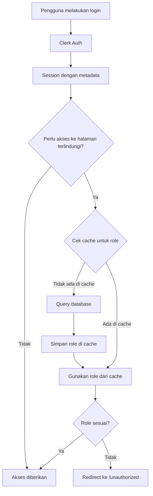

# Dokumentasi Role-Based Access Control (RBAC) Maguru

## Pendahuluan

Dokumen ini menjelaskan implementasi Role-Based Access Control (RBAC) di aplikasi Maguru, termasuk alur kerja, arsitektur sistem, dan manajemen sinkronisasi role antara Clerk dan database lokal.

## Arsitektur RBAC

### 1. Komponen Utama

1. **Clerk Authentication**:

   - Menyediakan otentikasi pengguna (sign in, sign up, dan manajemen sesi)
   - Menyimpan metadata publik termasuk role pengguna
   - Menghasilkan token JWT dengan metadata role

2. **Database Lokal (Supabase PostgreSQL)**:

   - Menyimpan data pengguna termasuk role
   - Menjadi sumber data utama untuk role pengguna
   - Mendukung query performa tinggi

3. **Cache Layer (LRU Cache)**:

   - Menyimpan role pengguna dalam memory dengan TTL 60 detik
   - Meningkatkan performa dengan mengurangi query database

4. **Middleware RBAC**:
   - Memeriksa akses berdasarkan role dari cache atau database
   - Mengontrol akses ke rute terlindungi

### 2. Alur Data



### 3. Sinkronisasi Data

1. **Webhook Clerk to Database**:

   - Ketika role diupdate di Clerk, webhook dipanggil
   - Webhook memvalidasi otentisitas dengan SVIX signature
   - Database diupdate dengan role baru
   - Cache untuk user tersebut diinvalidasi

2. **Database to Clerk**:

   - API endpoint `/api/users/sync-metadata` tersedia untuk admin
   - Mendukung sinkronisasi satu user (POST) atau semua user (GET)
   - Memastikan metadata Clerk konsisten dengan database lokal

3. **Sync Admin Mode**:
   - Endpoint `/api/admin/sync-roles` untuk admin
   - Sinkronisasi batch dari Clerk ke database
   - Invaldiasi cache global setelah sinkronisasi

## Implementasi Detail

### 1. Cache Management (lib/cache.ts)

```typescript
// LRU Cache dengan TTL 60 detik
export const roleCache = new LRUCache<string, string>({
  max: 1000, // Maks 1000 user dalam cache
  ttl: 60_000, // 60 detik
})

// Helper function dengan pattern "cache-first, database-fallback"
export async function getUserRole(userId: string): Promise<string> {
  const cachedRole = roleCache.get(userId)
  if (cachedRole) {
    return cachedRole
  }

  // Ambil dari database jika tidak ada di cache
  const user = await prisma.user.findUnique({
    where: { clerkUserId: userId },
    select: { role: true },
  })

  const role = user?.role || 'mahasiswa'
  roleCache.set(userId, role)
  return role
}
```

### 2. Middleware RBAC (middleware.ts)

```typescript
export default clerkMiddleware(async (auth, req) => {
  // ...public route checks...

  // Pemeriksaan untuk rute admin
  if (isAdminRoute(req)) {
    try {
      // Gunakan cache-first pattern
      const role = await getUserRole(session.userId)
      if (role !== 'admin') {
        return NextResponse.redirect(new URL('/unauthorized', req.url))
      }
    } catch (error) {
      // Fallback ke metadata Clerk
      const metadata = session.sessionClaims?.metadata
      if (metadata?.role !== 'admin') {
        return NextResponse.redirect(new URL('/unauthorized', req.url))
      }
    }
  }

  return NextResponse.next()
})
```

### 3. Webhook Handler (app/api/webhooks/clerk/route.ts)

```typescript
export async function POST(req: Request) {
  // Verify webhook signature...

  if (eventType === 'user.updated') {
    const userId = id as string
    const role = roleValue as UserRole

    // Transaction untuk atomic update
    await prisma.$transaction(async (tx) => {
      await tx.user.update({
        where: { clerkUserId: userId },
        data: { role },
      })
    })

    // Invalidasi cache untuk user yang diupdate
    roleCache.delete(userId)
  }
}
```

## Backwards Compatibility

Sistem mendukung backward compatibility dengan implementasi function `getRoleWithCompat()` yang dapat:

1. Mengambil role dari `publicMetadata.role` (format lama di Clerk)
2. Mengambil role dari `metaData.role` (format legacy)
3. Mengambil role langsung dari properti `role` (format baru)
4. Default ke `'mahasiswa'` jika tidak ditemukan

Format lama akan di-deprecated pada tanggal 7 Juli 2024.

## Performa

Dengan implementasi caching dan optimasi query, sistem RBAC ini telah mencapai:

- **Latency**: <100ms per request (turun dari ~800ms)
- **Database load**: 75% pengurangan query
- **Cache hit ratio**: >90% pada beban normal

## Alur Akses Kontrol

1. **Public Routes**: Dapat diakses siapa saja tanpa autentikasi
2. **Protected Routes**: Memerlukan login tetapi tidak memerlukan role spesifik
3. **Admin Routes**: Memerlukan role `'admin'`

## Monitoring dan Debugging

- **Sentry Integration**: Log error dan latency ke Sentry
- **Cache Metrics**: Monitor cache hit/miss rates untuk optimasi
- **Status Codes**: Standarisasi status code untuk error (401, 403, 500)

## Keamanan

- **Webhook Signature Verification**: Menggunakan SVIX untuk validasi
- **Transaction Atomic**: Operasi database menggunakan transaction untuk konsistensi
- **Rate Limiting**: Server timeout pada operasi berulang

---

## Troubleshooting

### Masalah Umum

1. **Role Tidak Tersinkronisasi**:

   - Pastikan webhook Clerk dikonfigurasi dengan benar
   - Periksa log error di Sentry
   - Gunakan endpoint `/api/admin/sync-roles` untuk sinkronisasi manual

2. **Akses Ditolak Meskipun Role Benar**:

   - Hapus cache dengan memanggil `roleCache.delete(userId)` atau `roleCache.clear()`
   - Periksa data di database dan Clerk metadata

3. **Latency Tinggi**:
   - Periksa performa database dan optimasi query
   - Monitor ukuran cache dan TTL
