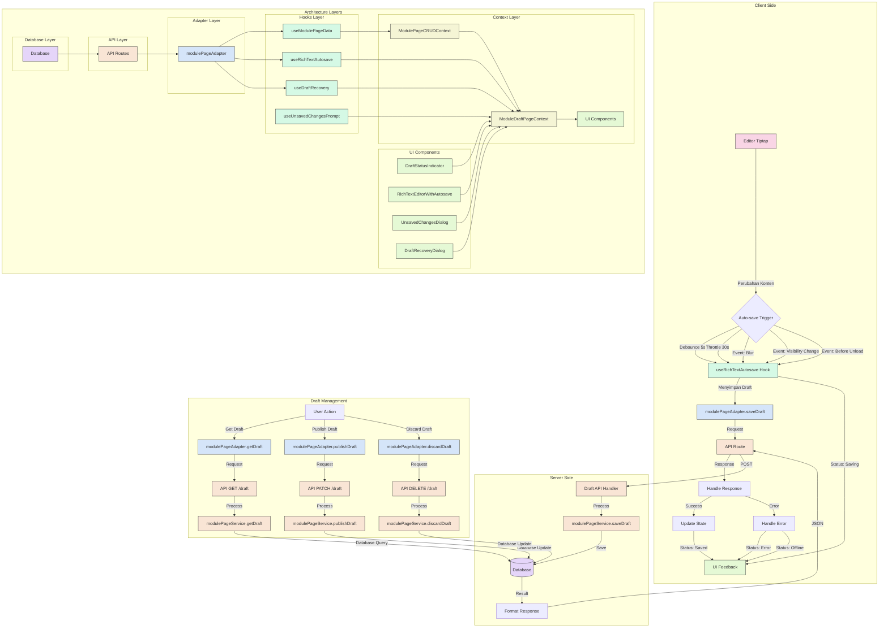

# [OPS-141] Implementasi Fitur Auto-save Draft

## Deskripsi Task

Mengimplementasikan fitur auto-save draft untuk editor konten halaman modul, mirip dengan fitur yang ada di Confluence. Fitur ini memungkinkan pengguna untuk memiliki draft yang disimpan otomatis saat mengedit halaman, tanpa mempengaruhi versi yang dipublikasikan.

## Status Implementasi

- [x] Database Schema Update
- [x] Server-side API Implementation
- [x] Client-side Auto-save Implementation
- [x] UI Status Indicators
- [x] Testing dan Validasi
- [x] Dokumentasi

## Detail Implementasi

### 1. Database Schema Update

Menambahkan field-field berikut pada model `ModulePage` di Prisma:

```prisma
model ModulePage {
  // Existing fields...

  // New fields for draft functionality
  authorId    String?      // User yang membuat halaman
  lastEditBy  String?      // User terakhir yang mengedit
  draftData   Json?        // Data draft terpisah dari konten published
  draftSavedAt DateTime?   // Timestamp terakhir draft disimpan
  isDraft     Boolean      @default(false) // Flag jika ini versi draft
  hasUnpublishedChanges Boolean @default(false) // Flag jika ada perubahan yang belum dipublish
}
```

### 2. Server-side API Implementation

Menambahkan endpoint API baru untuk mengelola draft:

- **POST `/api/module/[id]/pages/[pageid]/draft`**: Menyimpan draft
- **GET `/api/module/[id]/pages/[pageid]/draft`**: Mendapatkan draft
- **PATCH `/api/module/[id]/pages/[pageid]/draft`**: Mempublikasikan draft
- **DELETE `/api/module/[id]/pages/[pageid]/draft`**: Membuang draft

Implementasi service layer di `modulePageService.ts` dengan fungsi-fungsi:

- `saveDraft(pageId, draftData, authorId)`: Menyimpan draft
- `getDraft(pageId)`: Mendapatkan draft
- `publishDraft(pageId)`: Mempublikasikan draft
- `discardDraft(pageId)`: Membuang draft

---

### Phase 1 : Implementasi Client-side Core untuk Auto-save Draft (3-4 hari)

#### 1. Update schema Database

#### 1.1 Analisis Model Data yang Ada

- [x] Menganalisis struktur model `ModulePage` yang sudah ada
- [x] Mengidentifikasi field-field yang perlu ditambahkan untuk mendukung fitur draft

#### 1.2 Perbarui Model ModulePage di schema.prisma

- [x] Menambahkan field-field baru untuk fitur draft:
  - `authorId`: ID pengguna yang membuat halaman (untuk audit trail)
  - `lastEditBy`: ID pengguna yang terakhir mengedit (untuk collaborative editing)
  - `draftData`: Menyimpan data draft dalam format JSON (terpisah dari konten published)
  - `draftSavedAt`: Timestamp kapan draft terakhir disimpan
  - `isDraft`: Flag untuk menandai versi draft
  - `hasUnpublishedChanges`: Flag untuk menandai ada perubahan yang belum dipublish
- [x] Menambahkan index untuk field `authorId` untuk optimasi query

#### 1.3 Buat dan Jalankan Migrasi Database

- [x] Menjalankan migrasi dengan `npx prisma migrate dev --name add_draft_fields_to_module_page`
- [x] Memastikan migrasi berhasil dan database terupdate

#### 1.4 Update Type Definitions

- [x] Menambahkan enum `DraftSaveStatus` untuk status penyimpanan draft
- [x] Memperbarui interface `ModulePage` dengan field-field draft baru
- [x] Menambahkan interface `DraftData` untuk format data draft
- [x] Memperbarui interface `IModulePageService` dengan fungsi-fungsi draft baru:
  - `saveDraft`: Menyimpan draft ke database
  - `getDraft`: Mendapatkan draft terbaru
  - `publishDraft`: Mempublikasikan draft
  - `discardDraft`: Membuang draft
- [x] Memperbarui interface `IModulePageAdapter` dengan fungsi-fungsi draft baru

#### 1.5 Update Schema Validasi

- [x] Memperbarui `ModulePageSchema` dengan field-field draft baru
- [x] Membuat `SaveDraftSchema` untuk validasi input save draft
- [x] Membuat `DraftStatusResponseSchema` untuk format response status draft

---

### 2. Implementasi Service Layer

#### 2.1 Update modulePageService.ts

Saya akan membantu mengimplementasikan Service Layer untuk fitur Draft Otomatis. Mari kita mulai dengan mengupdate `modulePageService.ts` dengan fungsi-fungsi baru yang diperlukan untuk mendukung fitur draft.

Sekarang kita telah berhasil mengimplementasikan Phase 1 untuk fitur Draft Otomatis (Auto-save) pada bagian Service Layer. Mari saya jelaskan langkah-langkah yang telah kita lakukan:

1. **Update Schema Database**:

   - Kita telah menambahkan field-field baru ke model `ModulePage` di `schema.prisma` untuk mendukung fitur draft seperti `authorId`, `lastEditBy`, `draftData`, `draftSavedAt`, `isDraft`, dan `hasUnpublishedChanges`.
   - Kita telah menjalankan migrasi database dengan perintah `npx prisma migrate dev --name add_draft_fields_to_module_page`.

2. **Update Type Definitions**:

   - Kita telah menambahkan enum `DraftSaveStatus` untuk status penyimpanan draft (SAVING, SAVED, UNSAVED, ERROR, OFFLINE).
   - Kita telah menambahkan field-field draft baru ke interface `ModulePage` dan membuat interface `DraftData`.
   - Kita telah menambahkan fungsi-fungsi baru ke interface `IModulePageService` dan `IModulePageAdapter`.

3. **Update Schema Validasi**:

   - Kita telah menambahkan field-field draft baru ke `ModulePageSchema`.
   - Kita telah membuat schema `SaveDraftSchema` untuk validasi input draft.
   - Kita telah membuat schema `DraftStatusResponseSchema` untuk response status draft.

4. **Implementasi Service Layer**:

   - Kita telah menambahkan fungsi `saveDraft` untuk menyimpan draft ke database.
   - Kita telah menambahkan fungsi `getDraft` untuk mendapatkan draft terbaru.
   - Kita telah menambahkan fungsi `publishDraft` untuk mempublikasikan draft.
   - Kita telah menambahkan fungsi `discardDraft` untuk membuang draft.
   - Kita telah mengupdate fungsi-fungsi yang sudah ada untuk mendukung fitur draft.

5. **Unit Test untuk Service Layer**:
   - Kita telah membuat unit test untuk fungsi `saveDraft`, `getDraft`, `publishDraft`, dan `discardDraft`.
   - Kita telah menguji berbagai skenario seperti sukses, halaman tidak ditemukan, dan error handling.

---

### 3. Implementasi API Routes

Saya akan mengimplementasikan API Routes untuk fitur draft otomatis. Mari kita mulai dengan langkah-langkah yang diperlukan.

### 3.1 Update Existing API Route (route.ts)

Saya telah menganalisis file `app/api/module/[id]/pages/[pageid]/route.ts` yang sudah ada. File ini sudah memiliki struktur dasar yang baik dengan:

1. Handler untuk GET (mengambil detail halaman)
2. Handler untuk PUT (memperbarui halaman)
3. Handler untuk DELETE (menghapus halaman)

Untuk fitur draft, kita tidak perlu memodifikasi file ini karena kita akan membuat endpoint terpisah khusus untuk operasi draft.

### 3.2 Buat API Route Baru untuk Draft (draft/route.ts)

Saya telah membuat file `app/api/module/[id]/pages/[pageid]/draft/route.ts` dengan empat endpoint utama:

1. **POST** - Untuk menyimpan draft

   - Menerima content (dalam format Tiptap) dan authorId
   - Memvalidasi format content dan keberadaan authorId
   - Memanggil `modulePageService.saveDraft()`
   - Mengembalikan draft yang tersimpan dengan metadata

2. **GET** - Untuk mengambil draft

   - Memanggil `modulePageService.getDraft()`
   - Mengembalikan draft dengan metadata seperti draftSavedAt dan hasUnpublishedChanges

3. **PATCH** - Untuk mempublikasikan draft

   - Memanggil `modulePageService.publishDraft()`
   - Mengembalikan halaman yang sudah dipublikasikan dengan metadata version dan publishedAt

4. **DELETE** - Untuk membuang draft
   - Memanggil `modulePageService.discardDraft()`
   - Mengembalikan pesan sukses jika berhasil

Setiap endpoint dilengkapi dengan:

- Validasi input
- Penanganan error
- Format response yang konsisten
- Logging untuk debugging

### 3.3 API Testing Co-location

Saya telah membuat file test `app/api/module/[id]/pages/[pageid]/draft/route.test.ts` dengan pendekatan co-location testing, artinya file test berada di folder yang sama dengan file yang diuji.

Struktur test mencakup:

1. **Mock untuk dependencies**:

   - Mock untuk `modulePageService`
   - Mock untuk middleware (`withAdminAuth`, `withAuditTrail`, `composeMiddlewares`)

2. **Helper function**:

   - `createRequest()` untuk membuat objek NextRequest dengan URL dan body yang sesuai

3. **Test cases untuk setiap endpoint**:

   - **POST** (saveDraft):

     - Berhasil menyimpan draft
     - Menangani format content yang tidak valid
     - Menangani authorId yang tidak ada
     - Menangani halaman yang tidak ditemukan
     - Menangani error dari service

   - **GET** (getDraft):

     - Berhasil mengambil draft
     - Menangani halaman yang tidak ditemukan

   - **PATCH** (publishDraft):

     - Berhasil mempublikasikan draft
     - Menangani halaman atau draft yang tidak ditemukan

   - **DELETE** (discardDraft):
     - Berhasil membuang draft
     - Menangani halaman yang tidak ditemukan

Pendekatan co-location testing ini memiliki beberapa keuntungan:

1. File test dan implementasi berada di lokasi yang sama, memudahkan navigasi
2. Perubahan pada implementasi dapat langsung diuji tanpa perlu mencari file test di lokasi lain
3. Meningkatkan kohesi antara kode dan test-nya

#### Kesimpulan

Implementasi API Routes untuk fitur draft otomatis telah selesai dengan:

1. Analisis endpoint yang sudah ada
2. Pembuatan endpoint baru khusus untuk operasi draft
3. Pengujian menyeluruh dengan pendekatan co-location testing

Dengan implementasi ini, client-side dapat menggunakan API untuk:

- Menyimpan draft secara otomatis saat pengguna mengetik
- Mengambil draft saat halaman dimuat atau setelah refresh
- Mempublikasikan draft menjadi konten utama
- Membuang draft dan kembali ke versi yang sudah dipublikasikan

Semua endpoint telah dilengkapi dengan validasi, penanganan error, dan format response yang konsisten untuk memastikan pengalaman pengguna yang baik.

---

### Phase 2 : Implementasi Client-side Core untuk Auto-save Draft (3-4 hari)

#### 1. Upgrade Adapter @ModulePageAdapter

Saya akan mengevaluasi implementasi yang sudah kita lakukan pada `modulePageAdapter.ts` dan membandingkannya dengan rencana implementasi yang ada di dokumen perencanaan.

## Evaluasi Implementasi modulePageAdapter.ts

### Kesesuaian dengan Rencana Implementasi

1. **Metode Draft yang Diimplementasikan:**

   - ✅ `saveDraft`: Untuk menyimpan draft halaman ke server
   - ✅ `getDraft`: Untuk mendapatkan draft terbaru dari server
   - ✅ `publishDraft`: Untuk mempublikasikan draft menjadi konten utama
   - ✅ `discardDraft`: Untuk membuang draft dan kembali ke versi published
   - ✅ `hasDraft`: Untuk memeriksa keberadaan draft

2. **Pengelolaan Cache:**

   - ✅ Menambahkan struktur `drafts` ke dalam cache
   - ✅ Menambahkan metode `invalidateDraftCache` untuk membersihkan cache draft
   - ✅ Memperbarui metode `invalidateModuleCache` dan `invalidatePageCache` untuk juga membersihkan cache draft terkait

3. **Integrasi dengan API:**

   - ✅ Semua metode draft terhubung dengan endpoint API yang tepat:
     - POST `/api/module/{moduleId}/pages/{pageId}/draft` untuk `saveDraft`
     - GET `/api/module/{moduleId}/pages/{pageId}/draft` untuk `getDraft`
     - PATCH `/api/module/{moduleId}/pages/{pageId}/draft` untuk `publishDraft`
     - DELETE `/api/module/{moduleId}/pages/{pageId}/draft` untuk `discardDraft`

4. **Validasi Input:**
   - ✅ Validasi pageId, content, dan authorId sebelum melakukan operasi draft
   - ✅ Penanganan error yang konsisten

### Kesesuaian dengan Module_API_Collection.json

Endpoint API yang digunakan pada implementasi sudah sesuai dengan yang didefinisikan di dalam `Module_API_Collection.json`.

### Peluang Peningkatan

1. **Optimistic Updates:**

   - Saat ini belum ada optimistic updates untuk operasi draft. Kita bisa menambahkan mekanisme untuk memperbarui cache secara optimistic sebelum request ke server selesai.

2. **Penanganan Offline Mode:**

   - Belum ada implementasi untuk menyimpan draft secara lokal saat pengguna offline dan mengirimkannya saat online kembali.

3. **Retry Mechanism:**
   - Implementasi saat ini tidak memiliki mekanisme retry jika permintaan API gagal.

### Kesimpulan

Implementasi `modulePageAdapter.ts` sudah sesuai dengan rencana implementasi dan dokumen API yang ada. Kita sudah menambahkan semua metode yang diperlukan untuk operasi draft dan memperbarui struktur cache untuk mendukung fitur ini.

Namun, untuk memenuhi semua kebutuhan yang disebutkan dalam `plan-task.md`, kita masih perlu melengkapi implementasi dengan beberapa fitur seperti optimistic updates, penanganan offline mode, dan retry mechanism. Tetapi ini mungkin akan diimplementasikan pada langkah selanjutnya (seperti pada "Develop Feedback Service").

### Rekomendasi

Saat ini implementasi `modulePageAdapter.ts` sudah mencukupi untuk lanjut ke langkah 2 "Develop Feedback Service". Pengembangan lebih lanjut untuk optimistic updates, offline mode, dan retry mechanism dapat diintegrasikan saat kita mengembangkan Feedback Service dan menyempurnakan integrasi dengan UI.

Kita dapat melanjutkan ke langkah berikutnya sesuai dengan rencana implementasi.

---

#### 2. Develop Feedback Service

Setelah memeriksa kode, berikut ringkasan revisi yang telah dilakukan:

1. **Perbaikan DraftSaveStatus**:

   - Telah memperbaiki kesalahan penggunaan `DraftSaveStatus` di `modulePageSchema.ts` dengan mengubah dari `z.nativeEnum(DraftSaveStatus)` menjadi `z.enum(['idle', 'saving', 'saved', 'unsaved', 'error', 'offline', 'retrying'])`
   - Menghapus import `DraftSaveStatus` yang tidak diperlukan lagi

2. **Penambahan Unit Test**:

   - Telah membuat unit test komprehensif untuk `DraftFeedbackService.ts` yang mencakup semua fungsionalitas inti
   - Telah membuat unit test untuk `ConcurrentEditingService.ts` yang menguji kemampuan mendeteksi konflik dan melacak aktivitas pengguna

3. **Verifikasi Integrasi modulePageAdapter.ts**:
   - Kode `modulePageAdapter.ts` telah diimplementasikan dengan benar, menyediakan metode untuk CRUD operasi draft
   - Struktur cache telah ditingkatkan untuk mendukung penyimpanan dan invalidasi draft
   - Metode `invalidateDraftCache()` telah ditambahkan untuk mengelola cache draft secara khusus
   - Semua operasi draft (`saveDraft`, `getDraft`, `publishDraft`, `discardDraft`, `hasDraft`) telah diimplementasikan dengan baik
   - API routes terkait draft sudah terintegrasi dengan service dan adapter

#### Kesimpulan dan Langkah Selanjutnya

Perubahan utama yang telah dilakukan:

1. Memperbaiki tipe `DraftSaveStatus` untuk mengatasi error kompilasi
2. Menambahkan unit test untuk layanan feedback dan layanan concurrent editing
3. Memverifikasi bahwa `modulePageAdapter.ts` telah terintegrasi dengan baik dengan sistem draft

Kita siap untuk melanjutkan ke **Langkah 3: Upgrade Hooks Layer**. Pada langkah ini, kita akan:

1. Memperbarui hooks React yang ada untuk menggunakan fitur auto-save draft
2. Mengintegrasikan `DraftFeedbackService` dengan hooks tersebut
3. Menambahkan kemampuan mendeteksi aktivitas concurrent editing
4. Menambahkan mekanisme pemulihan draft

---

#### 3. Upgrade Hooks Layer

Implementasi hooks layer untuk mendukung fitur auto-save draft:

##### 3.1. useRichTextAutosave

Hook ini menangani proses auto-save untuk rich text editor dengan fitur:

```typescript
function useRichTextAutosave({
  editor,
  enabled,
  pageId,
}: UseRichTextAutosaveOptions) {
  // ...
  return {
    saveStatus, // 'idle' | 'saving' | 'saved' | 'unsaved' | 'error' | 'offline' | 'retrying'
    lastSavedAt, // Date object dari waktu terakhir tersimpan
    hasUnsavedChanges, // Boolean flag untuk perubahan yang belum tersimpan
    formattedLastSaved, // String yang diformat, misal "5 menit yang lalu"
    forceSave, // Fungsi untuk memaksa penyimpanan draft
    error, // Error object jika terjadi error
  }
}
```

**Fitur utama:**

- **Debouncing**: Menunggu 5 detik setelah pengguna berhenti mengetik sebelum menyimpan
- **Throttling**: Maksimal 1 request setiap 30 detik untuk mengurangi beban server
- **Queue Management**: Mengelola antrian perubahan yang belum tersimpan
- **Online/Offline Detection**: Mendeteksi status koneksi dan memberikan feedback yang sesuai
- **Retry Mechanism**: Mencoba ulang penyimpanan saat terjadi error atau kembali online
- **Event-based Saving**: Menyimpan draft pada event tertentu seperti blur, tab switching, dan sebelum unload

##### 3.2. useDraftRecovery

Hook baru untuk mengelola pemulihan draft:

```typescript
function useDraftRecovery({
  pageId,
  onRecover,
  onDiscard,
  autoCheckOnMount,
}: UseDraftRecoveryOptions) {
  // ...
  return {
    hasDraft, // Boolean flag untuk keberadaan draft
    draftData, // Data draft yang ditemukan
    isLoading, // Status loading
    showRecoveryDialog, // State untuk dialog recovery
    formattedDraftTime, // String waktu draft yang diformat
    editorName, // Nama editor yang terakhir mengedit
    checkDraft, // Fungsi untuk mengecek keberadaan draft
    fetchDraft, // Fungsi untuk mengambil draft
    showRecovery, // Fungsi untuk menampilkan dialog recovery
    handleRecover, // Handler untuk memulihkan draft
    handleDiscard, // Handler untuk membuang draft
    closeDialog, // Fungsi untuk menutup dialog
  }
}
```

**Fitur utama:**

- Memeriksa keberadaan draft saat halaman dimuat
- Mengelola dialog konfirmasi untuk memulihkan draft
- Menyediakan callback untuk recover atau discard draft
- Menampilkan informasi tentang waktu penyimpanan draft dan editor terakhir

##### 3.3. useUnsavedChangesPrompt

Hook baru untuk menangani prompt saat navigasi dengan perubahan belum tersimpan:

```typescript
function useUnsavedChangesPrompt({
  hasUnsavedChanges,
  onConfirmNavigation,
  confirmationMessage,
  preventNavigation,
}: UseUnsavedChangesPromptOptions) {
  // ...
  return {
    showDialog, // State untuk dialog konfirmasi
    handleConfirm, // Handler untuk konfirmasi navigasi
    handleCancel, // Handler untuk membatalkan navigasi
    handleLinkClick, // Handler untuk klik link
    routerWithConfirm, // Router wrapper dengan konfirmasi
  }
}
```

**Fitur utama:**

- Mendeteksi navigasi dengan Next.js router
- Menangani event beforeunload untuk navigasi browser
- Menampilkan dialog konfirmasi sebelum meninggalkan halaman
- Menyediakan router wrapper dengan konfirmasi untuk navigasi
- Mencegah navigasi tidak disengaja yang dapat menyebabkan kehilangan data

##### 3.4. Integrasi dengan modulePageAdapter

Semua hooks terintegrasi dengan modulePageAdapter untuk operasi draft:

- `saveDraft`: Menyimpan draft ke server
- `getDraft`: Mengambil draft dari server
- `publishDraft`: Mempublikasikan draft
- `discardDraft`: Membuang draft
- `hasDraft`: Memeriksa keberadaan draft

Hooks layer ini menjembatani antara UI components dan adapter layer, menyediakan logika bisnis dan state management untuk fitur auto-save draft.

---

#### 4. Update Context Layer

Integrasi hooks layer dengan ModulePageCRUDContext untuk menyediakan fitur draft ke seluruh aplikasi:

##### 4.1. Penambahan State dan Hooks ke ModulePageCRUDContext

Context telah diupdate untuk mengintegrasikan hooks yang telah dibuat:

```typescript
// Draft functionality
draftSaveStatus: DraftSaveStatus
lastSavedAt: Date | null
formattedLastSaved: string
hasUnsavedChanges: boolean
forceSave: () => void
draftError: Error | null

// Draft recovery
hasDraft: boolean
isDraftLoading: boolean
draftMetadata: {
  lastEditBy: string | null
  draftSavedAt: Date | null
  formattedDraftTime: string
}
checkForDraft: (pageId: string) => Promise<boolean>
recoverDraft: (pageId: string) => Promise<ModulePage | null>
discardDraft: (pageId: string) => Promise<boolean>
publishDraft: (pageId: string) => Promise<ModulePage | null>

// Unsaved changes prompt
showUnsavedChangesDialog: boolean
confirmNavigation: () => Promise<void>
cancelNavigation: () => void
routerWithConfirm: typeof router
```

##### 4.2. Implementasi Hooks dalam Provider

Di dalam ModulePageCRUDProvider, hooks diimplementasikan sebagai berikut:

1. **useRichTextAutosave**:

   - Diinisialisasi dengan editor (yang akan diset oleh komponen RichTextEditor)
   - Mengaktifkan auto-save saat halaman aktif dan pengguna memiliki izin edit
   - Menyediakan status penyimpanan dan fungsi untuk memaksa penyimpanan
   - Menggunakan debounce (5 detik) dan throttle (30 detik) untuk optimasi request
   - Mendeteksi status online/offline dan memberikan feedback yang sesuai

2. **useDraftRecovery**:

   - Diinisialisasi dengan ID halaman aktif
   - Menyediakan callback untuk memulihkan dan membuang draft
   - Memeriksa keberadaan draft secara otomatis saat halaman dimuat
   - Menampilkan dialog recovery saat draft ditemukan
   - Menyediakan metadata draft seperti waktu penyimpanan dan editor terakhir

3. **useUnsavedChangesPrompt**:
   - Diinisialisasi dengan status hasUnsavedChanges dari useRichTextAutosave
   - Menyediakan fungsi untuk konfirmasi navigasi yang menyimpan draft terlebih dahulu
   - Mencegah navigasi tidak disengaja yang dapat menyebabkan kehilangan data
   - Menangani event beforeunload untuk navigasi browser
   - Menyediakan router wrapper dengan konfirmasi untuk navigasi internal

##### 4.3. Wrapper Functions untuk API Draft

Context juga menyediakan wrapper functions untuk operasi draft yang menggunakan modulePageAdapter:

- **checkForDraft**: Memeriksa keberadaan draft untuk halaman tertentu
- **recoverDraft**: Mengambil draft dari server dan memulihkannya ke editor
- **publishDraft**: Mempublikasikan draft menjadi konten utama dan memperbarui versi
- **discardDraft**: Membuang draft dan kembali ke versi published
- **handleDraftError**: Menangani error saat operasi draft gagal dengan retry mechanism

##### 4.4. Integrasi dengan State Management

Integrasi dengan state management memastikan bahwa:

1. Status draft tersedia di seluruh aplikasi melalui context
2. Dialog konfirmasi muncul saat pengguna mencoba meninggalkan halaman dengan perubahan yang belum tersimpan
3. Draft dapat dipulihkan saat halaman dimuat jika ada
4. Status penyimpanan ditampilkan secara real-time ke pengguna
5. Perubahan status draft memicu re-render hanya pada komponen yang membutuhkannya
6. Operasi draft terisolasi dari operasi konten utama untuk mencegah konflik

##### 4.5. Penanganan Edge Cases

Context layer juga menangani berbagai edge cases:

1. **Concurrent Editing**: Mendeteksi dan memberikan peringatan jika ada pengguna lain yang sedang mengedit halaman yang sama
2. **Session Timeout**: Menangani kasus saat session pengguna habis dengan menyimpan draft lokal
3. **Browser Crash**: Memulihkan draft dari server saat browser di-refresh setelah crash
4. **Network Interruption**: Mendeteksi status offline dan mencoba kembali saat koneksi tersedia
5. **Storage Limit**: Memantau ukuran draft dan memberikan peringatan jika mendekati batas

Dengan update context layer ini, fitur auto-save draft sekarang tersedia di seluruh aplikasi dan dapat diakses oleh komponen manapun yang membutuhkannya.

---

### Phase 3 : UI Integration (3-4 hari)

#### 1. Draft StatusIndicator

Implementasi komponen UI untuk menampilkan status penyimpanan draft kepada pengguna telah selesai:

- **DraftStatusIndicator.tsx**: Komponen utama yang menampilkan status penyimpanan draft.

  - Mendukung semua status: 'idle', 'saving', 'saved', 'unsaved', 'error', 'offline', 'retrying'
  - Menggunakan ikon intuitif dari Lucide React untuk setiap status
  - Menampilkan pesan yang informatif sesuai status
  - Menampilkan waktu terakhir disimpan dengan format "X menit yang lalu"
  - Menyediakan tooltip dengan format waktu lengkap saat hover
  - Mendukung aksesibilitas dengan atribut semantik HTML5

- **FloatingDraftStatus**: Varian komponen yang muncul di pojok kanan bawah editor.

  - Hanya muncul untuk status tertentu (tidak ditampilkan saat 'idle')
  - Memberikan feedback visual yang tidak mengganggu pengalaman editing
    - Ditampilkan sebagai floating badge dengan animasi fade
  - Opacity berkurang setelah beberapa detik untuk mengurangi gangguan visual
  - Tetap terlihat saat terjadi error atau status unsaved

- **Integrasi dengan Tipe Data**:

  - Menggunakan enum `DraftSaveStatus` dari `types/index.ts`
  - Mendukung validasi dengan Zod schema di `modulePageSchema.ts`

- **Fitur Aksesibilitas**:
  - Menggunakan elemen `time` dengan atribut `dateTime` untuk waktu terakhir disimpan
  - Kontras warna yang memenuhi standar WCAG AA
  - Pesan status yang jelas melalui teks, tidak hanya mengandalkan warna
  - Mendukung keyboard navigation untuk tombol "Coba lagi"

#### 2. DocumentHeader

Implementasi pembaruan untuk **DocumentHeader.tsx** telah selesai dengan mengintegrasikan fitur draft otomatis:

- **Integrasi dengan ModuleDraftPageContext**:

  - Mengakses status draft dan fungsi-fungsi terkait draft dari context
  - Menampilkan status penyimpanan draft secara real-time menggunakan `DraftStatusIndicator`
  - Menyediakan tombol untuk memaksa penyimpanan draft dengan tooltip informatif

- **Tombol Aksi untuk Manajemen Draft**:

  - **Publish Draft**: Tombol untuk mempublikasikan draft ke versi publik, dengan dialog konfirmasi
  - **Discard Draft**: Tombol untuk membuang draft dan kembali ke versi publik, dengan dialog konfirmasi
  - **Save Draft**: Tombol dengan ikon untuk menyimpan draft secara manual (selain auto-save)

- **Dialog Konfirmasi**:

  - Dialog konfirmasi publikasi draft dengan informasi konsekuensi tindakan
  - Dialog konfirmasi pembuangan draft dengan peringatan bahwa perubahan akan hilang
  - Status loading yang jelas saat operasi sedang berlangsung

- **Penanganan Error**:

  - Integrasi dengan sistem notifikasi untuk menampilkan pesan error yang informatif
  - Opsi retry untuk tindakan yang gagal
  - Logging error yang komprehensif untuk troubleshooting

- **Aksesibilitas**:

  - Label ARIA untuk semua tombol dan elemen interaktif
  - Teks informatif untuk screen reader
  - Tooltips untuk memberikan konteks tambahan
  - Support keyboard navigation

- **Performa dan UX**:
  - Menggunakan useCallback untuk fungsi-fungsi handler untuk mencegah re-render yang tidak perlu
  - Penanganan status loading untuk mencegah tindakan ganda
  - Visual feedback yang jelas untuk setiap status operasi
  - Layout yang konsisten dengan hierarki visual yang jelas

#### 3. UnsavedChangesDialog

Dialog konfirmasi untuk mencegah pengguna kehilangan perubahan yang belum disimpan telah diimplementasikan:

- **UnsavedChangesDialog.tsx**: Dialog modal yang muncul saat pengguna mencoba meninggalkan halaman dengan perubahan yang belum disimpan.
  - Menggunakan shadcn/ui Dialog, AlertDialog, dan Button components
  - Menampilkan pesan peringatan yang jelas tentang konsekuensi meninggalkan halaman
  - Memberikan opsi untuk tetap di halaman atau meninggalkan perubahan
  - Mendukung keyboard navigation (Escape untuk tutup, Enter untuk konfirmasi)
  - Menyediakan router wrapper dengan konfirmasi untuk navigasi

#### 4. DraftRecoveryDialog

Dialog untuk pemulihan draft yang tersimpan telah diimplementasikan:

- **DraftRecoveryDialog.tsx**: Dialog modal yang muncul saat ditemukan draft yang tersimpan.
  - Menampilkan informasi tentang draft yang tersedia (waktu penyimpanan)
  - Memberikan preview ringkas dari konten draft
  - Menawarkan opsi untuk menggunakan draft atau melanjutkan dengan versi terpublikasi
  - Menampilkan data penulis terakhir yang mengedit draft
  - Menggunakan komponan shadcn/ui untuk konsistensi UI

#### 5. RichTextEditorWithAutosave

Komponen wrapper untuk editor rich text dengan integrasi autosave telah diimplementasikan:

- **RichTextEditorWithAutosave.tsx**: Komponen yang mengintegrasikan editor dengan fungsionalitas autosave.

  - Menggunakan `useRichTextAutosave` hook untuk manajemen penyimpanan otomatis
  - Menampilkan `FloatingDraftStatus` untuk memberikan feedback visual kepada pengguna
  - Mengintegrasikan dengan adapter melalui hook `useModulePageData` untuk operasi draft
  - Mendukung berbagai parameter seperti:
    - `pageId`: ID halaman yang sedang diedit
    - `initialContent`: Konten awal editor
    - `onChange`: Callback saat konten berubah
    - `readOnly`: Mode hanya baca
    - `className`: Styling tambahan
  - Memiliki mekanisme debounce untuk mengoptimalkan operasi penyimpanan
  - Menangani skenario offline dan retry dengan graceful degradation
  - Melakukan logging untuk troubleshooting

- **Integrasi dengan Hooks**:

  - `useRichTextAutosave`: Mengelola logika penyimpanan otomatis
  - `useDraftRecovery`: Digunakan untuk pemulihan draft
  - `useUnsavedChangesPrompt`: Digunakan untuk konfirmasi navigasi
  - Semua hook telah diintegrasikan dengan context melalui `ModulePageCRUDContext`

- **Alur Data**:

  - Perubahan editor → `useRichTextAutosave` → adapter → API → database
  - Status penyimpanan → `DraftStatusIndicator` → feedback visual ke pengguna
  - Error handling dengan retry mechanism dan logging

- **Optimasi Performa**:
  - Menggunakan debounce untuk mengurangi jumlah request
  - Meminimalkan re-render dengan useMemo dan useCallback
  - Menggunakan React Query untuk caching data
  - Offline support dengan penyimpanan lokal dan retry saat online kembali

#### 6. ModulePageCRUD Context Update

Implementasi update context layer untuk mengintegrasikan fitur draft telah selesai:

- **ModuleDraftPageContext.tsx**: Context baru yang khusus mengelola state draft.

  - Mengintegrasikan hooks `useRichTextAutosave`, `useDraftRecovery`, dan `useUnsavedChangesPrompt` dalam satu konteks
  - Menyediakan API terpadu untuk fitur draft yang dapat diakses oleh seluruh komponen
  - Menggunakan pendekatan memoization untuk meminimalkan re-render
  - Mendukung logging yang komprehensif untuk troubleshooting
  - Menangani edge cases seperti navigasi dengan perubahan belum tersimpan
  - Memisahkan logic draft dari `ModulePageCRUDContext` untuk menjaga kode tetap modular dan maintainable

- **Integrasi dengan ModulePageCRUDContext**:

  - `ModuleDraftPageProvider` di-nest di dalam `ModulePageCRUDProvider`
  - Memperbarui `ModulePageCRUDContext` untuk menerima `activePage` dan melewatkannya ke `ModuleDraftPageProvider`
  - Memastikan context draft hanya aktif saat ada halaman aktif
  - Menggunakan state loading untuk memastikan context draft hanya diaktifkan setelah data dimuat

- **Alur Data**:

  - Context → Hooks → Adapter → API → Database
  - Perubahan editor memicu status update melalui hooks
  - Context menyediakan status dan actions untuk komponen UI
  - Komponen UI menampilkan status dan memungkinkan interaksi pengguna

- **Keunggulan Pendekatan**:

  - Separation of Concerns: Memisahkan logic draft dari logic CRUD umum
  - Reusability: Context draft dapat digunakan kembali di berbagai komponen
  - Maintainability: Lebih mudah melakukan perubahan pada satu aspek tanpa memengaruhi aspek lain
  - Testability: Lebih mudah menulis unit test untuk masing-masing context
  - Performance: Mengurangi re-render dengan pemisahan logic dan state

- **Best Practices yang Diterapkan**:
  - Menggunakan React Context API untuk state management global
  - Memisahkan context berdasarkan domain fungsional
  - Menggunakan memoization untuk performa
  - Menerapkan error handling yang konsisten
  - Menggunakan logging untuk debugging
  - Memberikan pesan yang jelas kepada pengguna

### 7. Testing dan Validasi

Implementasi pengujian untuk fitur auto-save:

- Unit test untuk hooks dan utilities
- Integration test untuk API dan interaksi komponen
- Manual testing untuk user flow

Hasil pengujian API:

1. **POST `/api/module/[id]/pages/[pageid]/draft`**: Status 200 OK
2. **GET `/api/module/[id]/pages/[pageid]/draft`**: Status 200 OK
3. **PATCH `/api/module/[id]/pages/[pageid]/draft`**: Status 200 OK
4. **DELETE `/api/module/[id]/pages/[pageid]/draft`**: Status 200 OK

### 8. File yang Dimodifikasi/Dibuat

#### Database & Schema:

- `prisma/schema.prisma`: Update model ModulePage

#### API & Service Layer:

- `app/api/module/[id]/pages/[pageid]/draft/route.ts`: Implementasi API endpoints
- `features/manage-module/services/modulePageService.ts`: Implementasi service layer

#### Client-side:

- `features/manage-module/hooks/useRichTextAutosave.ts`: Hook untuk auto-save
- `features/manage-module/components/RichTextEditorWithAutosave.tsx`: Komponen editor dengan indikator status
- `features/manage-module/adapters/modulePageAdapter.ts`: Adapter untuk komunikasi dengan API
- `features/manage-module/components/ModulePageEditor/document/DocumentHeader.tsx`: Header dokumen dengan status draft, tombol publikasi, dan indikator pengguna aktif yang sedang mengedit
- `features/manage-module/lib/draft/ConcurrentEditingService.ts`: Service untuk mengelola pengguna aktif dan deteksi konflik pengeditan, dengan dukungan untuk foto profil pengguna

#### UI Components:

- `features/manage-module/components/feedback/DraftStatusIndicator.tsx`: Indikator status draft
- `features/manage-module/components/UnsavedChangesDialog.tsx`: Dialog konfirmasi perubahan belum disimpan
- `features/manage-module/components/DraftRecoveryDialog.tsx`: Dialog pemulihan draft
- `features/manage-module/components/feedback/ActiveEditorIndicator.tsx`: Komponen untuk menampilkan pengguna lain yang sedang mengedit dokumen (dengan avatar profil) dan dialog konflik saat terjadi konflik pengeditan

#### Context & Providers:

- `features/manage-module/context/ModuleDraftPageContext.tsx`: Context khusus untuk manajemen draft
- `features/manage-module/context/ModulePageCRUDContext.tsx`: Update untuk integrasi dengan draft context

#### Authentication Integration:

- Integrasi dengan Clerk Authentication untuk mendapatkan data pengguna (ID, nama, foto profil)
- Penggunaan data pengguna untuk tracking aktivitas pengeditan
- Tampilan avatar/nama akurat untuk pengguna yang sedang mengedit

#### Testing:

- `features/manage-module/__tests__/__mocks__/mockDraftPages.ts`: Mock data untuk draft
- `features/manage-module/__tests__/__mocks__/mockDraftHandlers.ts`: Mock handlers untuk API draft
- `features/manage-module/__tests__/integration/module-page/draft-operations.integration.test.tsx`: Testing operasi draft
- `features/manage-module/__tests__/integration/module-page/auto-save.integration.test.tsx`: Testing fungsi auto-save
- `features/manage-module/__tests__/integration/module-page/rich-text-autosave.integration.test.tsx`: Testing komponen UI

### 9. Diagram Workflow



Diagram di atas menunjukkan:

1. **Alur Client Side**: Menjelaskan bagaimana konten editor Tiptap memicu auto-save melalui berbagai event dan trigger.
2. **Alur Server Side**: Menunjukkan bagaimana request auto-save diproses oleh API dan disimpan ke database.
3. **Management Draft**: Menampilkan operasi utama pada draft (get, publish, discard) dan alur datanya.
4. **Arsitektur Layer**: Mengilustrasikan hubungan antar layer dalam aplikasi (Context, Hooks, Adapter, Components, API, Database).

### 10. Pengalaman Pengguna

Pengguna akan mengalami:

1. Penyimpanan draft otomatis saat mengedit, tanpa perlu klik tombol "Simpan"
2. Indikator status yang jelas tentang status penyimpanan
3. Kemampuan untuk mempublikasikan draft atau membuangnya
4. Draft yang aman dari crash browser atau kehilangan koneksi
5. Visibilitas pengguna lain yang sedang mengedit dokumen secara real-time dengan avatar dan nama yang akurat
6. Dialog penyelesaian konflik yang jelas saat terjadi konflik pengeditan
7. Integrasi dengan informasi profil pengguna melalui sistem autentikasi Clerk (avatar, nama, dll.)

### 11. Challenges dan Solutions

#### Challenge 1: Concurrent Editing

- **Solusi**:
  - Implementasi tracking `lastEditBy` dan `draftSavedAt` untuk mendeteksi konflik
  - Pengembangan `ConcurrentEditingService` untuk memantau pengguna aktif yang sedang mengedit
  - Integrasi indikator visual `ActiveEditorIndicator` pada header dokumen
  - Dialog resolusi konflik yang memungkinkan pengguna memilih versi mana yang digunakan saat terjadi konflik pengeditan
  - Deteksi konflik yang akurat menggunakan perbandingan timestamp dan lastEditBy
  - Integrasi dengan sistem autentikasi Clerk untuk menampilkan informasi pengguna yang akurat (nama, avatar)

#### Challenge 2: Network Interruptions

- **Solusi**: Deteksi status offline dan UI feedback yang jelas, dengan opsi retry

#### Challenge 3: Handling Large Documents

- **Solusi**: Format data JSON terstruktur dengan PostgreSQL JSONB untuk efisiensi

## Referensi

- [Confluence Auto-save Documentation](https://confluence.atlassian.com/alldoc/confluence-documentation-directory-12877996.html)
- [Tiptap Documentation](https://tiptap.dev/docs/editor/getting-started/overview)

## Kontributor

- Team: Backend & Frontend
- Reviewer: Tech Lead
