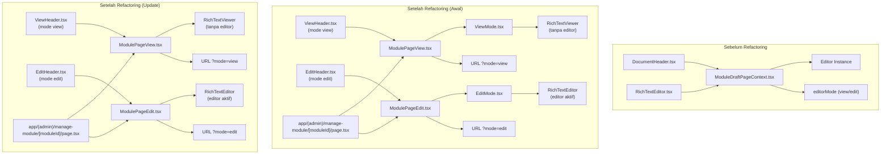

# Fase 4: Perencanaan Mode View dan Edit (Update 2)

## Pendekatan Baru

Setelah evaluasi, kita memutuskan untuk mengadopsi pendekatan Confluence dalam implementasi mode view dan edit. Alih-alih mencoba mengubah state editor yang sudah ada, kita akan menggunakan pendekatan yang lebih bersih dengan memisahkan komponen dan memanfaatkan routing.

## Masalah yang Dihadapi dengan Implementasi Sebelumnya

1. **Warning dan Error pada TipTap Editor**:

   - Upaya mengubah mode editor secara dinamis menyebabkan warning
   - TipTap tidak dirancang untuk beralih mode secara dinamis pada instance yang sama

2. **State Management yang Kompleks**:

   - Perlu mengelola banyak state untuk transisi mode
   - Potensi race condition saat mengubah state editor

3. **Performa Suboptimal**:
   - Re-render berlebihan saat beralih mode
   - Overhead performa karena editor tetap aktif di background saat mode view

## Pendekatan Confluence

Setelah mempelajari dokumentasi Confluence, kita menemukan bahwa mereka menggunakan pendekatan yang berbeda:

1. **URL Berbeda untuk Mode Berbeda**:

   - Mode view: `/pages/123?mode=view` (default)
   - Mode edit: `/pages/123?mode=edit`

2. **Komponen Terpisah**:

   - Komponen khusus untuk mode view (ringan, tanpa editor aktif)
   - Komponen khusus untuk mode edit (dengan editor TipTap aktif)

3. **Transisi Halaman**:

   - Navigasi penuh saat beralih mode, bukan hanya perubahan state
   - Memungkinkan browser menyimpan history (back/forward)

4. **Persistensi Data**:
   - Auto-save sebelum beralih dari mode edit ke view
   - Reload data segar saat masuk ke mode edit

## Evaluasi Kode yang Perlu Dibersihkan

Setelah menganalisis kode, berikut adalah komponen yang perlu dibersihkan untuk menghapus implementasi toggle mode lama:

1. **DocumentHeader.tsx**:

   - Menghapus logika toggle mode
   - Menghapus dependensi pada ModuleDraftPageContext untuk mode
   - Membuat dua komponen header terpisah: ViewHeader dan EditHeader

2. **RichTextEditor.tsx**:

   - Menghapus dependensi pada ModuleDraftPageContext
   - Menyederhanakan dengan menerima prop readOnly langsung
   - Menghapus logika perubahan mode dinamis

3. **ModuleDraftPageContext.tsx**:

   - Menghapus state dan handler terkait editorMode
   - Fokus pada fungsionalitas draft saja

4. **ModulePageCRUDContext.tsx**:
   - Menghapus referensi ke mode editor
   - Fokus pada operasi CRUD

## Implementasi Baru (Update 2)

Berikut adalah komponen baru yang telah dibuat:

1. **RichTextViewer.tsx**:

   - Komponen khusus untuk rendering konten dalam mode view
   - Implementasi ringan tanpa inisialisasi editor TipTap
   - Mengubah konten JSON ke HTML statis

2. **ViewHeader.tsx**:

   - Header khusus untuk mode view
   - Tombol edit untuk beralih ke mode edit

3. **EditHeader.tsx**:

   - Header khusus untuk mode edit
   - Input untuk mengedit judul
   - Tombol view untuk beralih ke mode view
   - Tombol publikasi dan discard draft

4. **ModulePageView.tsx**:

   - Komponen wrapper untuk mode view
   - Menggunakan ViewHeader dan RichTextViewer langsung
   - Tidak ada inisialisasi TipTap editor sama sekali

5. **ModulePageEdit.tsx**:

   - Komponen wrapper untuk mode edit
   - Menggunakan EditHeader dan RichTextEditor langsung

6. **app/(admin)/manage-module/[moduleId]/page.tsx**:
   - Diperbarui untuk merender ModulePageView atau ModulePageEdit berdasarkan parameter mode
   - Menggantikan implementasi lama yang menggunakan ModulePageEditor dengan prop readOnly

## Keuntungan Pendekatan Baru (Update 2)

1. **Performa Jauh Lebih Baik**:

   - Tidak ada editor TipTap sama sekali dalam mode view (sebelumnya menggunakan TipTap dalam mode readOnly)
   - Rendering statis untuk mode view yang sangat ringan
   - Struktur komponen yang lebih sederhana dengan lapisan yang lebih sedikit

2. **Kode Lebih Bersih**:

   - Pemisahan concern yang jelas
   - Tidak ada logika kompleks untuk toggle mode
   - Memisahkan kepentingan view dan edit sepenuhnya
   - Menghapus lapisan komponen yang tidak perlu (ViewMode dan EditMode)

3. **UX Lebih Baik**:

   - Konsisten dengan pengalaman Confluence yang familiar
   - Mendukung navigasi browser (back/forward)
   - Transisi lebih mulus antara mode

4. **Maintainability**:
   - Lebih mudah menambahkan fitur baru ke masing-masing mode
   - Lebih mudah men-debug masalah spesifik mode
   - Struktur folder lebih konsisten dengan standar industri
   - Hierarki komponen yang lebih sederhana dan mudah dipahami

## Struktur Routing

Struktur routing yang benar menggunakan app directory Next.js 13:

```
app/
├── (admin)/
│   └── manage-module/
│       ├── layout.tsx              # Layout untuk seluruh halaman manajemen modul
│       ├── page.tsx                # Halaman daftar modul (tabel modul)
│       └── [moduleId]/
│           ├── layout.tsx          # Layout khusus untuk editor halaman modul
│           └── page.tsx            # Halaman editor modul (view/edit berdasarkan query param)
└── manage-module/                  # Struktur lama (untuk kompatibilitas)
    └── [id]/
        └── page.tsx                # Redirect ke struktur baru
```

## Visualisasi Implementasi Baru



## Langkah Selanjutnya

1. **Testing**:

   - Unit test untuk RichTextViewer
   - Unit test untuk komponen baru lainnya
   - Integration test untuk alur kerja mode view/edit
   - E2E test untuk simulasi user flow

2. **Refining**:

   - Optimasi performa RichTextViewer
   - Memperbaiki rendering konten statis agar lebih akurat
   - Animasi transisi
   - Penyempurnaan UI

3. **Fitur Tambahan**:
   - Notifikasi perubahan belum disimpan
   - Konfirmasi saat meninggalkan halaman dengan perubahan
   - Integrasi dengan sistem riwayat versi

## Kesimpulan

Dengan mengadopsi pendekatan Confluence untuk mode view dan edit, kita telah mengatasi masalah dengan implementasi sebelumnya dan menciptakan solusi yang lebih bersih, lebih performa, dan lebih mudah dipelihara. Pendekatan ini juga memberikan pengalaman pengguna yang lebih baik dengan transisi yang mulus antara mode dan dukungan untuk navigasi browser.

Perbaikan utama dari versi sebelumnya adalah kita telah memisahkan sepenuhnya RichTextEditor dari mode view dengan membuat komponen RichTextViewer yang ringan, yang hanya merender konten tanpa menginisialisasi editor TipTap sama sekali. Ini memberikan peningkatan performa yang signifikan untuk mode view.

Selain itu, kita telah menyederhanakan struktur komponen dengan menghapus lapisan ViewMode dan EditMode yang tidak perlu, sehingga ModulePageView dan ModulePageEdit langsung menggunakan komponen yang mereka butuhkan. Ini membuat kode lebih mudah dipahami dan dipelihara.
